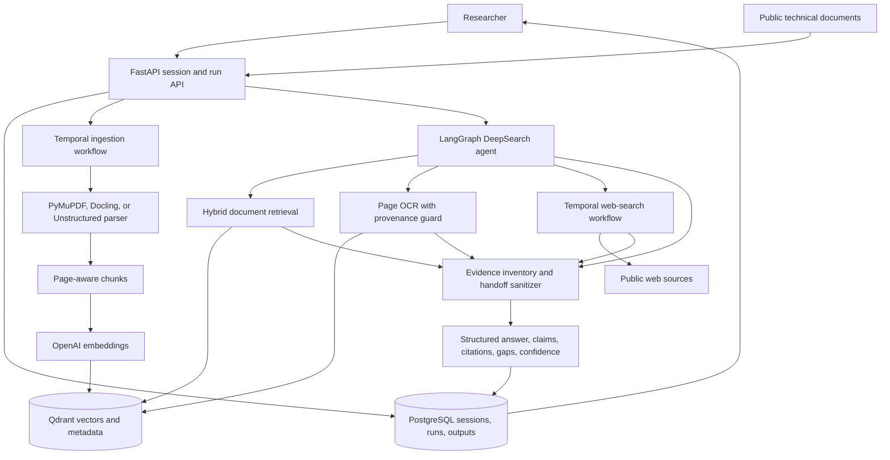

# ChemBiz architecture

ChemBiz separates request handling, durable orchestration, retrieval, model reasoning, and persistence. This boundary makes evidence provenance available to the final-answer sanitizer instead of trusting citations generated from model memory.

## Trust boundaries

- Secrets enter through environment variables and are not stored in the repository.
- Retrieved document citations must match canonical chunk, file, session, and page metadata returned by tools.
- Page OCR is accepted only for a page associated with an already retrieved chunk.
- Web citations are reconstructed from tool-returned URLs and bounded evidence excerpts.
- The final structured answer can still be incomplete or scientifically wrong; citation validation establishes provenance, not scientific truth.

## Runtime dependencies

The API and Temporal worker use PostgreSQL, Qdrant, Temporal, OpenAI models, and Tavily search. Docker Compose supplies the local service topology. OpenAI and Tavily remain external services, so a full end-to-end run requires credentials and network access.
